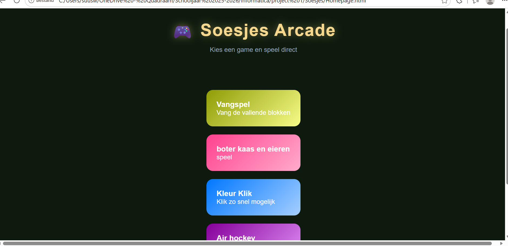
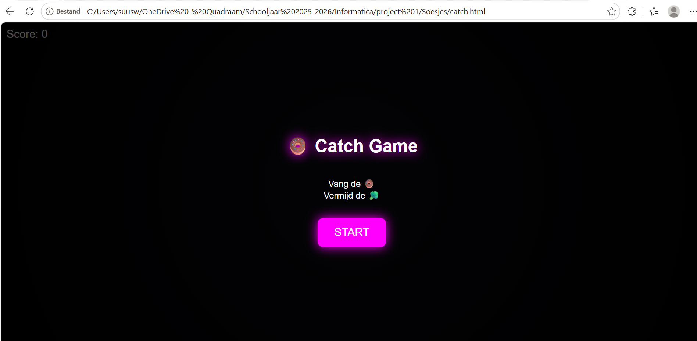
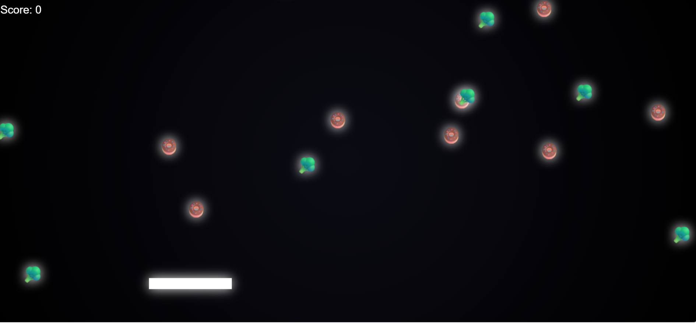
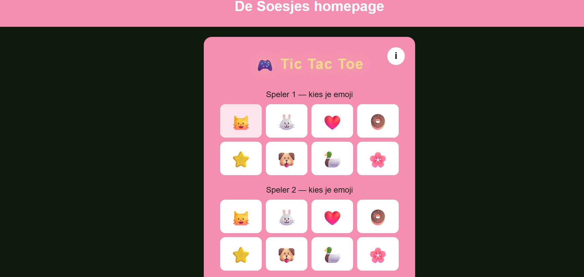
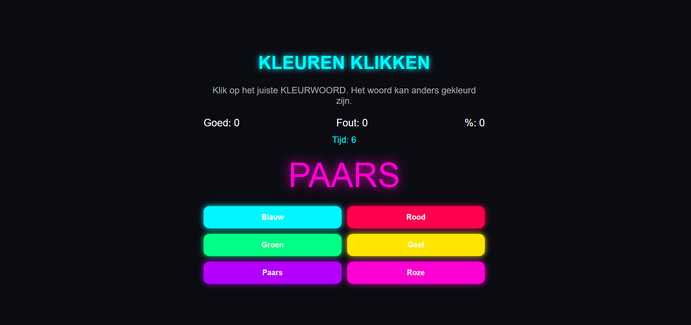
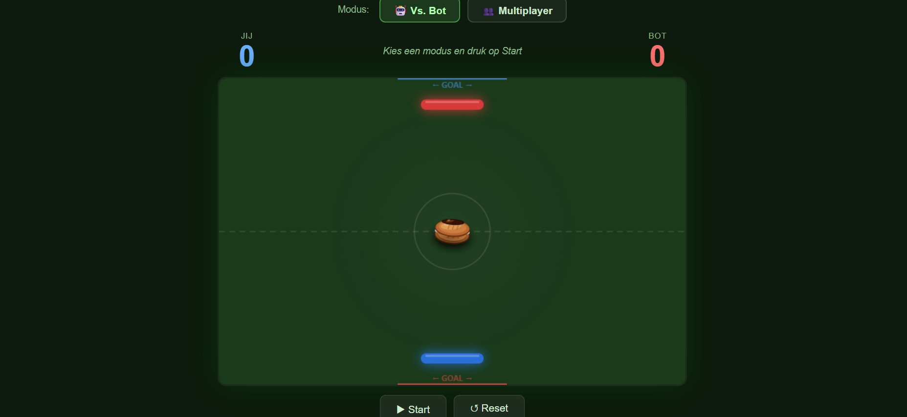
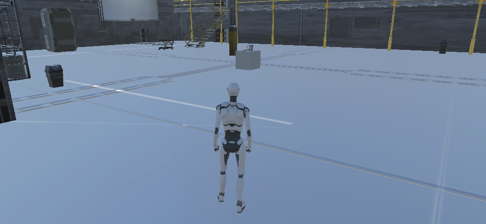
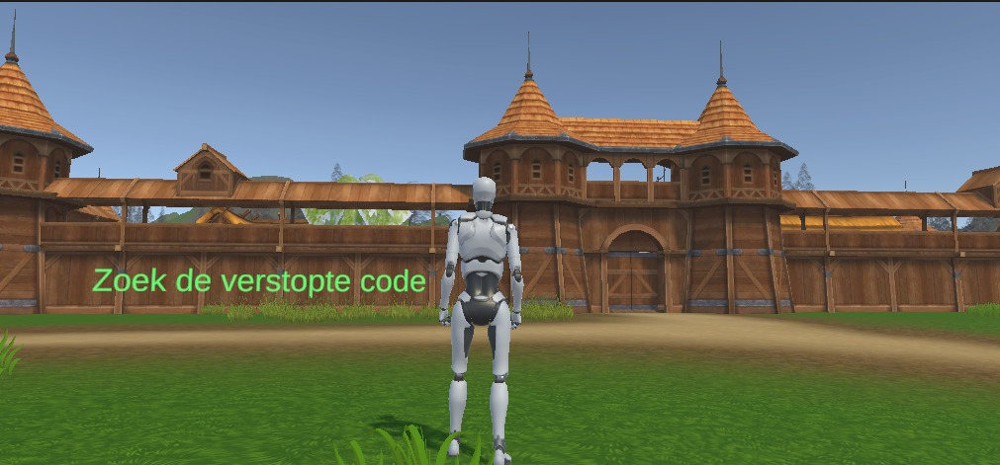
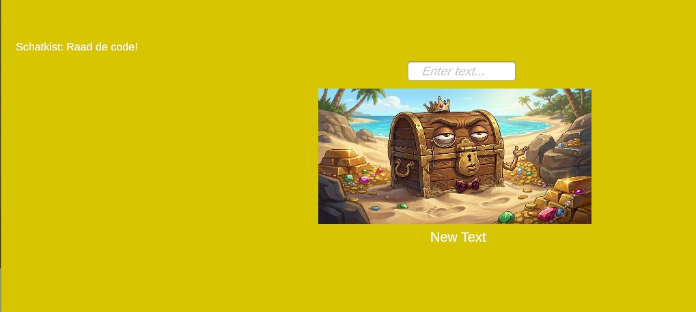

# 🎮 Soesjes Arcade

## Korte beschrijving

Soesjes Arcade is een website waarop gebruikers verschillende spellen kunnen spelen vanaf één centrale homepage.

De website bevat:

* Neon Soesjes Catch
* Boter, Kaas en Eieren
* Kleuren Klikken
* Airhockey
* Saving Tomorrow (Unity-Game)

Vier spellen zijn gemaakt met HTML, CSS, JavaScript en met behulp van Claude AI. Eén spel is gemaakt in Unity.

---

## Screenshots

### Homepage

We hebben ervoor gekozen om voor elk spel een andere kleur te gebruiken, zodat de website aantrekkelijker wordt en wat vrolijker. 

### Neon Soesjes Catch

Bij deze game is het de bedoeling dat je de donuts vangt en de broccoli over slaat. we hebben hier zo voor gekozen, omdat onze website 'Soesjes Arcade' heet, dus je moet de lekkernijen vangen en de gezonde dingen (broccoli) overslaan.
### Boter, Kaas en Eieren

op deze pagina kan je kiezen of je tegen iemand anders die naast zit wilt spelen of dat je tegen een bot wil spelen. Ook kan je zelf de emoji's kiezen waarmee jij en je tegenstander of bot kan spelen. 
### Kleuren Klikken

bij dit spel wordt je reactiesnelheid getest. klik zo snel mogelijk op de kleur die er staat en scoor zo punten. We hebben hier gekozen voor een rustige achtergrond, zodat je de kleuren goed kan blijven zien en het overzichtelijk blijft
### Airhockey

Een super leuk vermakelijk spel, waarmee je met een Soesje airhockey gaat spelen!
---

### Saving Tomorrow 

Ontcijfer de toekomst. we hebben er een grimmige sfeer van gemaakt, je gaat terug in de tijd om de toekomst te veranderen. Dit is dus de slechte tijd van de toekomst

Vindt de code. je gaat heir terug in de tijd en kan door de code te vinden verder reizen naar de piraten

Dit is de minigame die je speelt zodra je op het pirateneiland bent aangekomen. hier hebben we gekozen voor de gele achtergrond, zodat het een beetje goud was om in thema te blijven van de schatkist.

## Product uitvoeren

1. Open `Homepage.html`.
2. Kies een spel op de homepage.
3. Start het gekozen spel.

---

## Uitleg voor de beoordeling

Voor Domein 2 (Interactie) is een apart document toegevoegd met daarin het gebruikersonderzoek, de resultaten en de verbeteringen.

Voor Domein 3 (Gamedesign) is een apart document toegevoegd met daarin het ontwerp van het Unity-spel.

---

## Beoordelingsdomeinen

Dit project wordt beoordeeld op:

1. Website (Webdesign)
2. Interactie
3. Gamedesign
   - de unity game (saving tomorrow)
